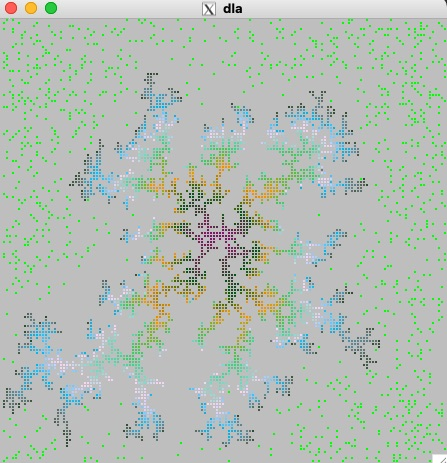

# Diffusion-limited aggregation cellular automaton

This code intricately simulates the diffusion-limited aggregation cellular automaton, a complex system based on the RWCA model [1,2,3]. It uses [GSL](https://www.gnu.org/software/gsl/) for the random number generator and [EGGX](https://www.ir.isas.jaxa.jp/~cyamauch/eggx_procall/index.html) for graphics.

The updated rules are as follows.

- Each walker embarks on a fascinating journey of random steps across the 2D lattice, guided by the RWCA rule. Meanwhile, a seed walker remains at the center site, a steadfast point in the ever-changing landscape.

- When a walker comes into contact with the seed walker, it also becomes a part of the seed walker and does not move anymore.

To compile the code, type 'make' in the program directory.

This is a snapshot of the system. Green dots represent moving walkers, while the walkers captured by the seed are colored differently depending on the CA time steps taken when they were captured.

[1] [Cellular automaton model for random walkers](https://journals.aps.org/prl/abstract/10.1103/PhysRevLett.77.1675)

[2] [Cellular automaton model for biased diffusive traffic flow](https://journals.jps.jp/doi/abs/10.1143/JPSJ.65.3415)

[3] [Probabilistic Cellular Automaton for Random Walkers](https://journals.jps.jp/doi/abs/10.1143/JPSJ.69.1352)

